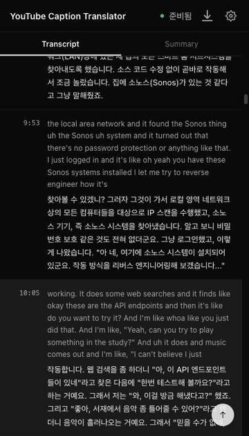
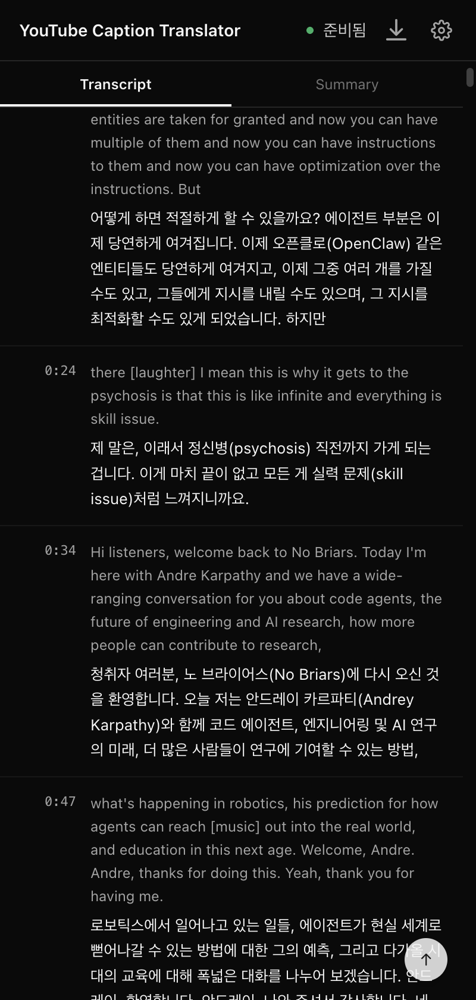
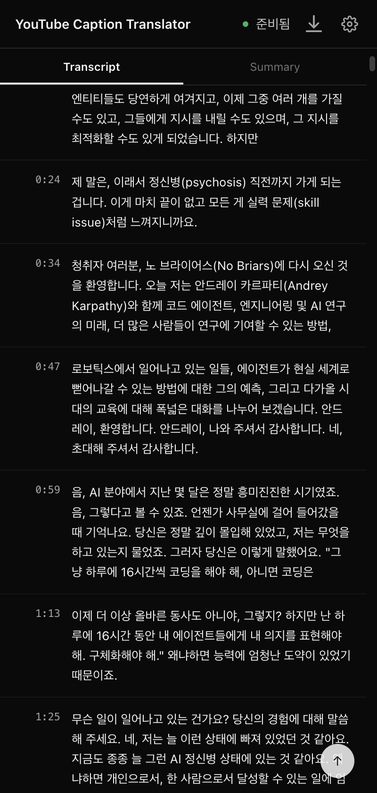
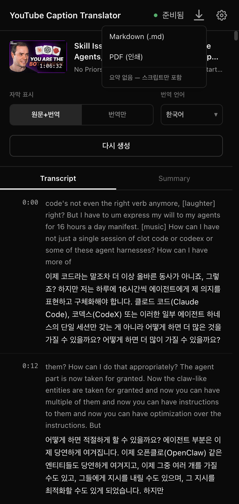
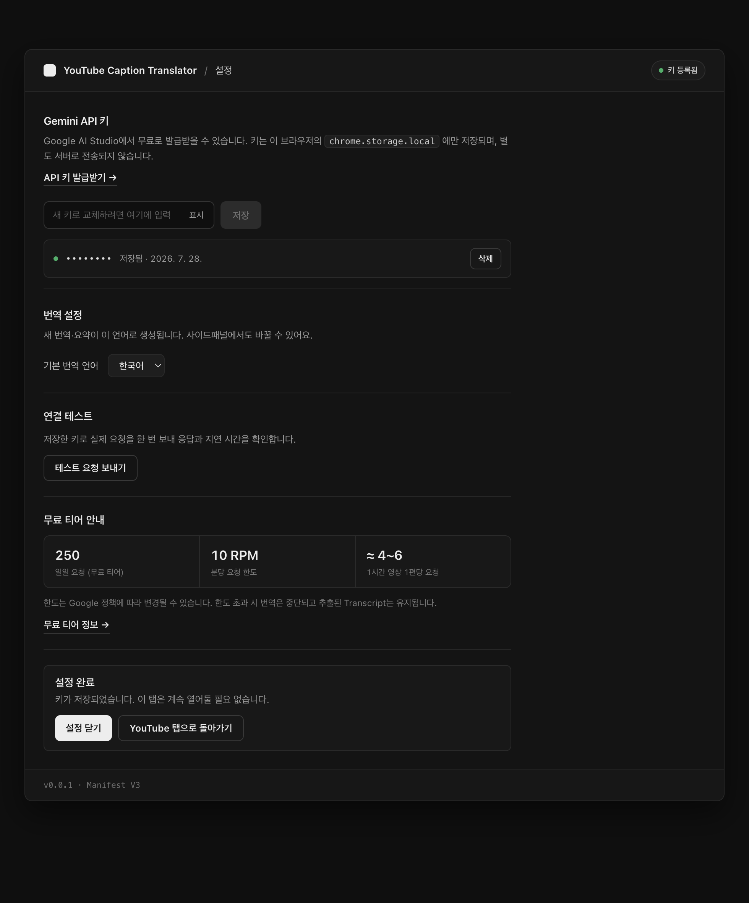

# YouTube Caption Translator

유튜브 기술 강연·팟캐스트의 자막을 통째로 번역해서, **영상 재생을 따라가는
스크립트**로 옆에 띄워주는 크롬 확장 프로그램입니다.

자동 생성 자막은 문장이 뚝뚝 끊기고 용어도 제각각이라 그대로 읽기 어렵습니다.
이 확장은 자막 전체를 한 번에 읽어 용어를 먼저 정리한 뒤 번역하기 때문에,
같은 용어가 영상 내내 같은 말로 번역됩니다.

> 개인 학습용으로 만든 도구입니다. 크롬 웹스토어에 등록되어 있지 않아
> 아래 방법으로 직접 설치해야 합니다. 번역에는 본인의 Google Gemini API 키가
> 필요합니다(무료 티어로 사용 가능).

---

## 이렇게 동작합니다

영상이 재생되는 동안 지금 나오는 구간이 자동으로 따라 내려갑니다.
반대로 스크립트의 아무 줄이나 누르면 영상이 그 지점으로 이동합니다.



| 화면 | |
| --- | --- |
|  | **원문 + 번역**<br>회색이 원문, 아래가 번역입니다. 왼쪽 시간을 보고 원하는 구간으로 바로 이동할 수 있습니다. |
|  | **번역만**<br>원문을 숨기고 번역만 봅니다. 선택한 모드는 다음에 열 때도 유지됩니다. |
|  | **내려받기**<br>스크립트와 요약을 Markdown 파일로 저장하거나 PDF로 인쇄합니다. |

이 밖에

- **요약 탭** — 문제 제기·핵심 주장·발표 흐름·키워드·결론으로 정리해 줍니다.
  각 구간 제목을 누르면 영상의 해당 지점으로 이동합니다.
- **번역 언어** — 한국어 / 영어 / 일본어 / 중국어 중에 고를 수 있습니다.
- **다시 보기** — 한 번 만든 번역은 브라우저에 저장돼서, 같은 영상을 다시 열면
  기다림 없이 바로 뜹니다.

---

## 설치하기

개발 도구를 다뤄본 적 없어도 5분이면 됩니다. 크롬(또는 엣지·웨일 같은
크로미움 계열 브라우저)이 필요합니다.

### 1. 확장 파일 내려받기

[Releases 페이지](https://github.com/picpal/youtube-caption-translator/releases)에서
가장 최신 버전의 `youtube-caption-translator-*.zip`을 내려받습니다.

### 2. 압축 풀기

내려받은 zip의 압축을 풉니다. **압축을 푼 폴더는 앞으로 계속 그 자리에
있어야 합니다.** 나중에 폴더를 지우거나 옮기면 확장 프로그램이 사라집니다.
`다운로드` 폴더처럼 정리하다 지우기 쉬운 곳 말고, 문서 폴더 안에 따로
자리를 만들어 두는 걸 권합니다.

### 3. 크롬에 올리기

1. 주소창에 `chrome://extensions` 를 입력하고 엔터를 칩니다.
2. 화면 **오른쪽 위의 「개발자 모드」** 스위치를 켭니다.
3. 왼쪽 위에 나타난 **「압축해제된 확장 프로그램을 로드합니다」** 버튼을 누릅니다.
4. 2번에서 압축을 푼 폴더를 고릅니다.
   폴더를 열었을 때 `manifest.json` 파일이 바로 보이는 그 폴더여야 합니다.
   (안 열리면 폴더 한 겹 안쪽을 골라보세요.)

목록에 **YouTube Caption Translator** 가 나타나면 성공입니다.

### 4. 툴바에 고정하기

주소창 오른쪽의 퍼즐 조각 아이콘을 누르고, 목록에서 이 확장의 압정(📌)
아이콘을 눌러 고정합니다. 이제 툴바 아이콘을 누르면 사이드패널이 열립니다.

### 5. Gemini API 키 등록하기

번역은 Google의 Gemini AI가 합니다. 본인 계정의 키가 필요합니다.

1. <https://aistudio.google.com/apikey> 에 접속해 구글 계정으로 로그인합니다.
2. **Create API key** 를 눌러 키를 만들고 복사합니다. (`AIza…` 로 시작합니다)
3. 확장의 사이드패널을 열고 오른쪽 위 **톱니바퀴** 아이콘을 눌러 설정으로 갑니다.
4. 복사한 키를 붙여넣고 **저장**을 누릅니다.
5. **「테스트 요청 보내기」** 를 눌러 `정상 응답` 이 뜨면 준비 끝입니다.



키는 이 브라우저 안에만 저장되고 어디로도 전송되지 않습니다.

### 6. 이미 열어둔 유튜브 탭은 새로고침

설치 전부터 열려 있던 유튜브 탭에서는 확장이 동작하지 않습니다.
`F5`(맥은 `Cmd+R`)로 한 번 새로고침해 주세요. 설치 후에 새로 여는 탭은
그럴 필요 없습니다.

---

## 사용하기

1. 유튜브에서 **자막이 있는** 영상을 엽니다.
2. 툴바의 확장 아이콘을 눌러 사이드패널을 엽니다.
3. **「AI 자막 생성」** 을 누릅니다.
4. 다 되면 스크립트가 나타납니다. 영상을 재생하면 알아서 따라 내려가고,
   줄을 누르면 그 지점으로 이동합니다.
5. 위쪽 **Summary** 탭에서 요약을, **내려받기** 아이콘에서 Markdown/PDF 저장을
   할 수 있습니다.

번역이 도는 동안에는 사이드패널을 열어두는 편이 좋습니다.

---

## 얼마나 걸리나요

**1시간짜리 영상 기준 처음 한 번에 5~8분**쯤 걸립니다. 커피 한 잔 내리고
오시면 되는 정도입니다.

| | |
| --- | --- |
| 1시간 영상 (처음 생성) | **5~8분** |
| 같은 영상 다시 열기 | 즉시 (브라우저에 저장돼 있음) |
| 요약 생성 | 번역이 끝난 뒤 별도로, 영상 길이에 따라 수십 초 |

실제 측정 예 — 1시간 6분짜리 대담 영상(자막 322구간)이 **7분 53초**
걸렸습니다.

왜 이렇게 걸리냐면, 자막을 50구간씩 잘라 순서대로 번역 요청을 보내기
때문입니다. 1시간 영상 하나에 Gemini 요청이 대략 9~10번(용어 분석 1번 +
번역 7~8번 + 요약 1번) 나갑니다. 한꺼번에 몰아 보내면 무료 티어의 분당 요청
한도에 걸려서, 일부러 순서대로 보냅니다.

무료 티어 한도는 설정 화면에도 표시되며, 2026년 7월 기준 **하루 250회 /
분당 10회**입니다. 하루에 영상 20편 이상을 돌리는 게 아니라면 넉넉합니다.
(한도는 Google 정책에 따라 바뀔 수 있습니다.)

---

## 안 되는 것 · 알아둘 것

- **자막이 없는 영상은 번역할 수 없습니다.** 유튜브의 자막(자동 생성 포함)을
  읽어서 번역하는 방식이라, 자막 자체가 없으면 「자막 없음 — 생성 불가」가
  뜹니다.
- **쇼츠와 라이브 방송은 지원하지 않습니다.**
- **아주 긴 영상은 요약이 실패할 수 있습니다.** 1시간이 넘는 영상에서 요약
  생성이 시간 초과로 실패하는 경우를 확인했습니다. 번역 자체는 정상입니다.
- 번역 품질은 원본 자막의 품질을 따라갑니다. 자동 생성 자막은 사람 이름이나
  제품명이 잘못 받아적히는 일이 흔하고, 그건 번역에도 그대로 남습니다.
- 크롬 웹스토어에 없는 확장이라, 크롬을 켤 때마다 「개발자 모드 확장 프로그램을
  사용 중지하시겠습니까?」 같은 안내가 뜰 수 있습니다. 닫아도 계속 동작합니다.

## 개인정보

- API 키는 브라우저의 `chrome.storage.local` 에만 저장됩니다.
- 번역문과 요약은 브라우저의 IndexedDB에만 저장됩니다. 별도 서버가 없습니다.
- 외부로 나가는 통신은 **Google Gemini API 호출 하나뿐**입니다. 자막 원문이
  번역을 위해 Google로 전송됩니다.
- 확장이 요구하는 권한: `storage`, `sidePanel` 과
  `youtube.com` · `generativelanguage.googleapis.com` 두 도메인 접근뿐입니다.
  다른 사이트의 탭을 읽지 않습니다.

---

## 개발

기술 스택은 WXT + React + TypeScript + Tailwind, Manifest V3입니다.
빌드·테스트·실제 크롬 검증 도구는 [docs/DEVELOPMENT.md](docs/DEVELOPMENT.md)
를 보세요.

```bash
pnpm install
pnpm test      # vitest
pnpm build     # .output/chrome-mv3
```

기획 문서는 [PRD.md](./PRD.md), 진행 계획은
[IMPLEMENTATION_PLAN.md](./IMPLEMENTATION_PLAN.md) 에 있습니다.
